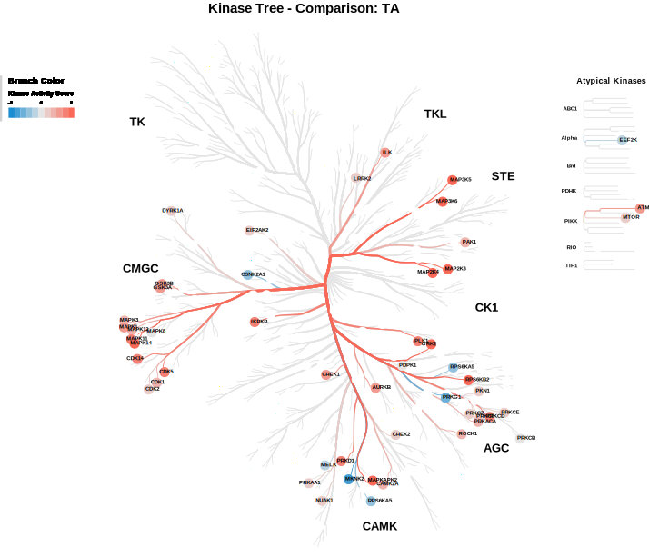

# ProTN
ProTN is a novel R Shiny web app of an integrative pipeline that can perform all the steps of proteomics and phospho-proteomic analysis downstream of peptide quantification. ProTN works with any MS proteomic experiments managed with Proteome Discoverer and MaxQuant, two of the most used bioinformatic platforms to obtain peptide abundances from raw MS spectra. The implementation of ProTN focuses on being user-friendly, quick in doing the analysis, and comprehensive in the generation of images and tables that help the biological interpretation of results.

All the required information can be found on the info page of the web app.

## Before starting
### Dependencies
ProTN requires R version >= 4.1 and RStudio.

The app should automatically started installing all the required package. Otherwise the manual installation can be done via the **INSTALL.R** script. Before execute the shiny app verify the correct installation.

## How execute the app
  1. Open the file **app.R**.
  2. Click **Run App**

## Getting help
The menu is on the left of the web page, it contain the guide pages for ProTN and PhosProTN and the tabs for the execution of the pipelines. Last tab are the contacts.

The two info tabs containt information about the workflow and detailed information about the input and output files.

Bugs and errors can be reported at the issues page on GitHub. Before filing new issues, please read the documentation and take a look at currently open and already closed discussions.

## Workflow description 
**Note1**

The case study reported is the comparison of polysome-associated proteins with total proteins in human MCF7 cells. (PRIDE: PXD009417)

Clamer M, Tebaldi T, Lauria F, et al. Active Ribosome Profiling with RiboLace. Cell Rep. 2018;25(4):1097-1108.e5.

### ProTN
ProTN is an integrative pipeline that analyze DDA proteomics data obtained from MS. It perform a complete analysis of the raw files from Proteome Discoverer (PD) or MaxQuant (MQ), with their biological interpretation with enrichement and network analysis. ProTN executes a dual level analysis, at protein and peptide level.

#### Set settings for the execution and read the raw data from loaded files
ProTN analyse the results of Proteome Discoverer and MaxQuant. The essential parameters and files to run ProTN are: (additional details on the input can be found in the ProTN info tab)

- **Title of Analysis**: title of the experiment. It will be the title of the web page report.
- **Software Analyzer**: determine with software was use to identify peptides and proteins (PD for Protein Discoverer, MQ for MaxQuant).
- **Sample Annotation file**: file with the information about the samples and the correlation between replicate ID and condition. (WARNING: Condition name MUST contain at least 1 character!)
    *   **Condition** column (`REQUIRED`): define the condition of each sample that divide the samples in groups. The conditions need to be the same of the the Contrast Design. (WARNING: Condition name MUST contain at least 1 character!)
    *   **Color** columns (`OPTIONAL`): define a color for the samples in the graphs. If not present use a default palette.
    *   **MS\_batch** columns: define the groups of batch in the samples. `REQUIRED FOR BATCH EFFECT CORRECTION`.
    *   **Sample** column: define the names for the samples.
        *   In case of **PD** files use the _Sample\_Annotation_ file obtained from PD, the **Sample** column in optional, if is not present the software extract the names for the **File Name** column.
        *   In case of **MQ** analysis the this column is `REQUIRED`. **`ATTENTION`****: SAMPLE NAME MUST BE EQUAL TO THE NAME INSERTED IN MAXQUANT (name of the column in peptide file).**
- **Peptides file**: raw file of peptides obtained from PD or MQ (file peptides.txt).
- **Proteins file**: raw file of protein groups obtained from PD or MQ (file proteinGroups.txt).
- **Design for the comparison file**: Excel file containing the formulas of the contrast comparison you want to analyse. [Example of Design file in Data folder] The table can have 3 columns:
    
    *   **Formule** column (`REQUIRED`): The formulas need to follow the syntax of [Limma](https://bioinf.wehi.edu.au/limma/). `AT LEAST 1 FORMULA IS REQUIRED`.
    *   **Name** column (`OPTIONAL`): personalized name assign to the comparison.
    *   **Color** columns (`OPTIONAL`): define a color for the condition in the graphs. If not present use the default palette.

#### Normalization and imputation of the intensities
The intensities are log2 transformed and normalized with DEqMS (Zhu 2022). Two methods are applied because a double normalization is required, one for peptides and one for proteins. At the peptide level, the normalization is done by the function equalMedianNormalization, which normalizes intensity distributions in samples so that they have median equal to 0.

At the protein level, this operation is executed by the function medianSweeping. It applies the same median normalization used for peptides, but also it summarizes the peptide intensities into protein relative abundance by the median sweeping method.

After the normalization the intensities from Mass Spectrometer need to be imputed. The principal method is based on the PhosR package (Kim et al. 2021) that performs a complex and well-balanced imputation of the data based on the conditions of the samples. As a backup method in case of problems with PhosR imputations, ProTN uses a Gaussian round imputation.

In this step, two MDSs and two PCAs (proteins and peptides) are generated.

#### Statistical differential analysis
The workflow continue with the differential analysis. This phase is applied to proteins and peptides, to obtain the significant proteins and peptides. Two slightly different methodologies are applyed since for proteins is used the DEqMS package (Zhu 2022), instead, for peptides is used the usual Limma package (Ritchie et al. 2015). DEqMS is developed on top of Limma, but the method estimates different prior variances for proteins quantified by different numbers of PSMs/peptides per protein, therefore achieving better accuracy.

Limma and DEqMS calculate DEPs for each comparison in the design file parameter. Each peptide or protein has different parameters: the log2 Fold Change, the P.Value, the adjusted P.Value and the log2 expression. In this pipeline, a protein/peptide is significant if passing 3 thresholds. A protein/peptide for each comparison can be Up-regulated or Down-regulated. It is Up-regulated if:

- the log2 FC is higher than the Fold Change threshold (FC > Log2 FC thr),
- the P.Value is lower than the threshold (P.Value < P.Value thr),
- the log2 expression is higher than the threshold (log2 expression > Signal log2 expr thr).

It is Down-regulated if:

- the log2 FC is lower of the Fold Change threshold (FC < -Log2 FC thr),
- the P.Value is lower than the threshold (P.Value < P.Value thr),
- the log2 expression is higher than the threshold (log2 expression > Signal log2 expr thr).

In the output, for each comparison, this distinction is reported in the “class” column, which assumes value “+” if is up-regulated, “-” if down-regulated and “=” if it is not significant.

Various figures are generated, first a bar plot that graphically represents the DEPs identified. Followed by comparison-specific volcano plots.

#### Report creation and download of the results
The results are summarized in a web-page HTML report. Other than this, the experiment is described by a large number of files, a description of each file generated can be found in section 4. Details on the output files. All the files are group in a zip file and downloaded.

.png)

#### ADDITIONAL STEPS:
##### B1. Batch Effect correction
If required by the experiment, a batch correction step can be applyed using proBatch (Cuklina et al. 2018). The batches need to be defined in the Sample_Annotation file where column MS_batch is required.

##### E1. Enrichment analysis of the Differentially Expressed Proteins
The biological interpretation of the Differentially Expressed Proteins starts with the enrichment step. To execute this analysis, ProTN uses EnrichR (Jawaid 2022), a widely used tool that search on a large number of data sets to obtain information about many categories. EnrichR organises its hundreds of data sets in 8 sections: Transcription, Pathways, Ontologies, Diseases/Drugs, Cell Types, Misc, Legacy, and Crowd.

Since the analysis that a user wants to perform can be different, each comparison has 3 sets of proteins: the Up-regulated (called Up), the Down-regulated (called Down), and the set (called all) obtained by the merge of Up- and Down-regulated proteins. EnrichR provides for each term much information. It returns the statistical parameters, like P.Value, fdr, odds ratio and combined score. At the same time, it gives the overlap size, the number of genes in the term and the genes of the input list find in the term.

The tons of data downloaded from EnrichR are exported in two modalities. The tool creates an RData of the complete data frame, in this way the user can easily import in R to perform further analysis and plots. But also, it generates an Excel file with only the significant terms. The process uses the filters define in the options file to differentiate the relevant terms from the globality.

A term to be significative need to have:
- a P.Value lower of P.Value thr for enrichment (P.Value < P.Value thr for enrichment),
- an Overlap Size higher than Overlap size thr for enrichment (Overlap Size > Overlap size thr for enrichment).

Besides that, the pipeline plots the enrichment results in different figures. The 4 plots can be split into 2 categories. The first two are filtered on the data-sets, they illustrate only the data-sets written in the column DB to analyse of the options file. The other 2 are filtered on words to search on the term description, it uses the list of words in column Terms to search.

###### E1.1. Enrichment analysis of the whole set of proteins discovered by the experiment
In same cases can be usefull have the enrichment of the whole proteome discovered by the experiment. For example it can be used as negative control of the differentially expressed proteins. So, the entire proteome is analysed with EnrichR, and saved in an RData and in an Excel file. Also, as before, 4 plots can be generated, in this case adding as last dot column the negative control provided by the whole proteome.

##### N1. Protein-Protein Interaction network analysis of Differentially Expressed Proteins
Last analitical step is the Protein-Protein Interaction (PPI) network analysis, since PPIs are essential in almost all processes of the cell, and it is crucial for understanding cell physiology in different states. For each comparison, ProTN analyses the interaction between the DEPs using STRING (Szklarczyk et al. 2021).

The species-specific database is retrieved from STRING server, an accurate analysis discover all the interactions and an iGraph (Csardi and Nepusz 2006) network is generated. Later, the proteins are clustered via iGraph function which identify dense subgraph by optimizing modularity score.

Since the network can vary a lot on composition, two ggplot layout are used: Fruchterman-Reingold algorithm and the Kamada-Kawai algorithm.

### PhosProTN
PhosProTN is an integrative pipeline for phosphoproteomic analysis of DDA experimental data obtained from MS. It perform a complete analysis of the raw files from Proteome Discoverer (PD) or MaxQuant (MQ), with their biological interpretation, enrichement and network analysis. 
PhosProTN analyse the phosphoproteomic data at peptide level, with background the proteomic analysis.

*The phospho-workflow is similar to the one described previously, below are reported only the different steps.*

#### Set settings for the execution and read the raw data from loaded files
ProTN analyse the results of Proteome Discoverer and MaxQuant. The essential parameters and files to run ProTN are: (additional details on the input can be found in the ProTN info tab)
- **Title of Analysis**: title of the experiment. It will be the title of the web page report.
- **Software Analyzer**: determine with software was use to identify peptides and proteins (PD for Protein Discoverer, MQ for MaxQuant).
- **Design for the comparison file**: Excel file containing the formulas of the contrast comparison you want to analyse. [Example of Design file in Data folder] The table can have 3 columns:
    
    *   **Formule** column (`REQUIRED`): The formulas need to follow the syntax of [Limma](https://bioinf.wehi.edu.au/limma/). `AT LEAST 1 FORMULA IS REQUIRED`.
    *   **Name** column (`OPTIONAL`): personalized name assign to the comparison.
    *   **Color** columns (`OPTIONAL`): define a color for the condition in the graphs. If not present use the default palette.
*   **Required for Proteome Discoverer**:
    *   **PROTEOMIC files:**
        *   `Sample Annotation file`: file with the information about the samples and the correlation between replicate ID and condition of the proteomic (WARNING: Condition name MUST contain at least 1 character!). The **Sample\_Annotation** file is an Excel file with the following column \[Example of an Sample\_Annotation file HERE...\]:
            
            *   **Condition** column (`REQUIRED`): define the condition of each sample that divide the samples in groups. The conditions need to be the same of the the Contrast Design and the same of the phospho-proteomics. (WARNING: Condition name MUST contain at least 1 character!)
            *   **Color** columns (`OPTIONAL`): define a color for the samples in the graphs. If not present use a default palette.
            *   **MS\_batch** columns: define the groups of batch in the samples. `REQUIRED FOR BATCH EFFECT CORRECTION`.
            *   **Sample** column: define the names for the samples. In case of **PD** files use the _Sample\_Annotation_ file obtained from PD, the **Sample** column in optional, if is not present the software extract the names for the **File Name** column.
        *   `Peptides file`: raw file of peptides.
            
        *   `Proteins file`: raw file of protein groups.
            
    *   **PHOSPHO-PROTEOMIC files:**
        *   `Sample Annotation file`: file with the information about the samples and the correlation between replicate ID and condition of the phospho-proteomics (WARNING: Condition name MUST contain at least 1 character!). The **Sample\_Annotation** file is an Excel file with the following column \[Example of an Sample\_Annotation file HERE...\]:
            
            *   **Condition** column (`REQUIRED`): define the condition of each sample that divide the samples in groups. The conditions need to be the same of the the Contrast Design and the same of the proteomics. (WARNING: Condition name MUST contain at least 1 character!)
            *   **Color** columns (`OPTIONAL`): define a color for the samples in the graphs. If not present use a default palette.
            *   **MS\_batch** columns: define the groups of batch in the samples. `REQUIRED FOR BATCH EFFECT CORRECTION`.
            *   **Sample** column: define the names for the samples. In case of **PD** files use the _Sample\_Annotation_ file obtained from PD, the **Sample** column in optional, if is not present the software extract the names for the **File Name** column.
        *   `Peptides file`: raw file of peptides.
            
        *   `Proteins file`: raw file of protein groups.
            
        *   `PSM file`: raw file of the PSM obtained from PD. It is required to overcome the uncertain phosphorilation site identification.
*   **File Required for MaxQuant**:
    *   **PROTEOMIC files:**
        *   `Sample Annotation file`: file with the information about the samples and the correlation between replicate ID and condition of the proteomic (WARNING: Condition name MUST contain at least 1 character!). The **Sample\_Annotation** file is an Excel file with the following column:
            
            *   **Condition** column (`REQUIRED`): define the condition of each sample that divide the samples in groups. The conditions need to be the same of the the Contrast Design and the same of the phospho-proteomics. (WARNING: Condition name MUST contain at least 1 character!)
            *   **Sample** column (`REQUIRED`): define the names for the samples. **`ATTENTION`****: SAMPLE NAME MUST BE EQUAL TO THE NAME INSERTED IN MAXQUANT (name of the column in peptide file).**
            *   **Color** columns (`OPTIONAL`): define a color for the samples in the graphs. If not present use a default palette.
            *   **MS\_batch** columns: define the groups of batch in the samples. `REQUIRED FOR BATCH EFFECT CORRECTION`.
        *   `Evidence file`: raw file of peptides. The file required is the **evidence.txt** file.
            
    *   **PHOSPHO-PROTEOMIC files:**
        *   `Sample Annotation file`: file with the information about the samples and the correlation between replicate ID and condition of the phospho-proteomics (WARNING: Condition name MUST contain at least 1 character!). The **Sample\_Annotation** file is an Excel file with the following column:
            
            *   **Condition** column (`REQUIRED`): define the condition of each sample that divide the samples in groups. The conditions need to be the same of the the Contrast Design and the same of the proteomics. (WARNING: Condition name MUST contain at least 1 character!)
            *   **Sample** column (`REQUIRED`): define the names for the samples. **`ATTENTION`****: SAMPLE NAME MUST BE EQUAL TO THE NAME INSERTED IN MAXQUANT (name of the column in peptide file).**
            *   **Color** columns (`OPTIONAL`): define a color for the samples in the graphs. If not present use a default palette.
            *   **MS\_batch** columns: define the groups of batch in the samples. `REQUIRED FOR BATCH EFFECT CORRECTION`.
        *   `Evidence file`: raw file of peptides. The file required is the **evidence.txt** file

#### ADDITIONAL STEPS:
##### K1. Activity kinase tree analysis of the Differentially Expressed Phosphosite
Last analitical step is the kinase tree analysis. In phospho-proteomic it extremely useful to study the activation status of the kinase based on the differentially expressed substrate idenfied by the differential analysis. For each comparison, PhosProTN predicts the activation state of the kinases using PhosR (Kim et al. 2021). PhosR provides a kinase-substrate relationship score, and on that it prioritises potential kinases that could be responsible for the phosphorylation change of phosphosite on the basis of kinase recognition motif and phosphoproteomic dynamics.

The activity score provide by PhosR is used to generated a graphical versione of the human kinome tree using CORAL (Metz K.S. et al. 2018), a web shiny app for visualizing both quantitative and qualitative data. It generates high-resolution scalable vector graphic files suitable for publication without the need for refinement in graphic editing software.

## Contacts
Gabriele Tomè, Developer: gtome@fbk.eu; gabriele.tome@unitn.it

Dr. Toma Tebaldi, PI: toma.tebaldi@unitn.it
