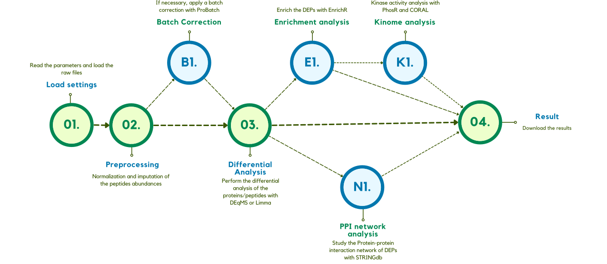

# ProTN

Version: 0.1.3

ProTN is now a Shiny app that provides an integrated pipeline for the complete downstream analysis of proteomics, phospho-proteomics, and interactomics data following peptide quantification. The app features four distinct workflows—proTN, phosproTN, phosproTN with proteome background, and interacTN—each accessible through a separate tab in the application menu.

ProTN is compatible with MS-based proteomic experiments processed using Proteome Discoverer and MaxQuant, two of the most widely used platforms for extracting peptide abundances from raw MS spectra. For proteome and interactomics analyses, it also supports input files generated by FragPipe and Spectronaut.

Designed to be user-friendly, fast, and comprehensive, ProTN delivers high-quality visualizations and tables to facilitate the biological interpretation of results across a range of experimental setups.

All the required information can be found on the info page of the web app.

## Before starting

### Dependencies

ProTN requires R version \>= 4.1 and RStudio.

The app should automatically started installing all the required package. Otherwise the manual installation can be done via the `INSTALL.R` script. Before execute the shiny app verify the correct installation.

## How execute the app

1.  Open the file **app.R**.
2.  Click **Run App**

## Getting help

The menu is on the left of the web page, it contain the guide pages for all the workflows and the tabs for the execution of the pipelines. Last tab are the contacts.

The two info tabs containt information about the workflow and detailed information about the input and output files.

## Case study example

**Note**: the case study reported is the comparison of polysome-associated proteins with total proteins in human MCF7 cells. (PRIDE: PXD009417) (Clamer M, Tebaldi T, Lauria F, et al. Active Ribosome Profiling with RiboLace. Cell Rep. 2018;25(4):1097-1108.e5.)

## Workflow description

### ProTN

ProTN is an integrative pipeline that analyze DDA proteomics data obtained from MS. It perform a complete analysis of the raw files from different software, with their biological interpretation with enrichement and network analysis. ProTN executes a dual level analysis, at protein and peptide level.

#### Set settings for the execution and read the raw data from loaded files {#set-settings-for-the-execution-and-read-the-raw-data-from-loaded-files}

ProTN analyse the results of Proteome Discoverer and MaxQuant. The essential parameters and files to run ProTN are: (additional details on the input can be found in the ProTN info tab)

-   **Software Analyzer**: determine with software was use to identify peptides and proteins.
    -   **PD**: Proteome Discoverer
    -   **MQ**: MaxQuant
    -   **SP**: Spectronaut
    -   **FP**: FragPipe

##### File required for Proteome Discoverer

-   `Annotation file`: This file provides metadata for the samples analyzed. It must be an Excel file with the following required columns:

    | Column Name | Description                                             |
    |-------------|---------------------------------------------------------|
    | `File ID`   | Identifier used in column headers of the peptide file.  |
    | `Condition` | Experimental group name. Used for comparisons.          |
    | `Sample`    | Clean sample name used downstream.                      |
    | `color`     | (Optional) Plot color. Defaults are applied if missing. |
    | `batch`     | (Optional) Batch ID for batch effect correction.        |

-   `Peptides file`: Excel table with annotated peptides and abundance values.

    | Column Name                    | Description                                                 |
    |------------------------|------------------------------------------------|
    | `Master Protein Accessions`    | Maps peptide to protein; only first ID is kept.             |
    | `Annotated Sequence`           | Amino acid sequence including PTM annotations.              |
    | `Modifications`                | Post-translational modifications.                           |
    | `Positions in Master Proteins` | Position of peptide in the protein sequence.                |
    | `Abundance: <File ID>`         | Intensity/abundance for each sample. One column per sample. |

-   `Proteins file`: Excel table contain descriptive and accession information for proteins.

    | Column Name   | Description                                                |
    |----------------|-------------------------------------------------------|
    | `Accession`   | Unique protein identifier, used to join with peptide file. |
    | `Description` | Descriptive string, e.g., from UniProt.                    |

##### File required for MaxQuant

-   `Annotation file`: This file provides metadata for the samples analyzed. It must be an Excel file with the following required columns:

    | Column Name | Description                                                                                  |
    |------------------|------------------------------------------------------|
    | `Condition` | Experimental condition (e.g. Control, Treated). Used for group comparison.                   |
    | `Sample`    | Sample identifier. Must match sample names in the peptide file.                              |
    | `color`     | (Optional) Color associated with the condition. If not present, default colors are assigned. |
    | `batch`     | (Optional) Batch ID for batch effect correction. Required if batch correction is enabled.    |

-   **Evidence pipeline**:

    -   `evidence.txt`: This is a TSV/CSV file containing peptide-level quantification data. **Required columns:**

        | Column Name             | Description                                                           |
        |-------------------|-----------------------------------------------------|
        | `Sequence`              | Amino acid sequence of the peptide.                                   |
        | `Modifications`         | PTMs of the peptide.                                                  |
        | `Gene names`            | Gene symbol associated with the peptide.                              |
        | `Protein names`         | Protein description. If missing, will be merged from annotation file. |
        | `Leading razor protein` | UniProt accession. Used for annotation enrichment.                    |
        | `Raw file`              | File/sample ID. Must match entries in the annotation file.            |
        | `Intensity`             | Peptide intensity value. Used for quantification.                     |
        | `Leading proteins`      | Used for filtering out contaminants (e.g. "CON\_").                   |

-   **Peptide and ProteinGroups pipeline**:

    -   `peptides.txt`: Tab-delimited file with peptide-level quantification. **Required columns:**

        | Column Name             | Description                                                           |
        |-------------------|-----------------------------------------------------|
        | `Sequence`              | Amino acid sequence of the peptide.                                   |
        | `Gene names`            | If missing, inferred from `Leading razor protein`.                    |
        | `Protein names`         | Protein description. If missing, will be merged from annotation file. |
        | `Leading razor protein` | UniProt accession. Used for annotation enrichment.                    |
        | `Intensity <Sample>`    | Intensity values for each sample (e.g. `Intensity Sample1`).          |

    -   `proteinGroups.txt`: Tab-delimited file providing protein-level information. **Required columns:**

        | Column Name            | Description                                  |
        |------------------------|----------------------------------------------|
        | `Majority protein IDs` | Used to extract the `Leading razor protein`. |
        | `Fasta headers`        | Used for protein description.                |

##### File required for Spectronaut

-   `Annotation file`: (Optional) If provided, this file should contain metadata for each sample. If not provided, the pipeline will extract sample annotations directly from the peptide file.

    | Column Name | Description                                                                        |
    |----------------|--------------------------------------------------------|
    | `Condition` | Experimental group label. Used for comparison between conditions.                  |
    | `Sample`    | Sample identifier. Must match entries in the peptide file.                         |
    | `color`     | (Optional) Color for visualization. Default colors will be assigned if missing.    |
    | `batch`     | (Optional) Batch ID for batch correction. Required if batch correction is enabled. |

-   `Spectronaut report`: This is a TSV/CSV file containing peptide-level data. **Required columns:**

    | Column Name            | Description                                                           |
    |-------------------|-----------------------------------------------------|
    | `PG.ProteinAccessions` | Protein group accessions.                                             |
    | `PEP.StrippedSequence` | Peptide sequence without modifications.                               |
    | `EG.ModifiedSequence`  | Peptide sequence with modifications.                                  |
    | `PEP.Quantity`         | Peptide quantification value.                                         |
    | `R.FileName`           | Sample identifier (column used is defined by `sample_col`).           |
    | `R.Condition`          | Condition identifier (column used if `annotation file` not provided). |

##### File required for FragPipe

-   `Annotation file`: This file provides metadata for the samples analyzed. It must be an Excel file with the following required columns:

    | Column Name | Description                                                                                  |
    |------------------|------------------------------------------------------|
    | `Condition` | Experimental condition (e.g. Control, Treated). Used for group comparison.                   |
    | `Sample`    | Sample identifier. Must match sample names in the peptide file.                              |
    | `color`     | (Optional) Color associated with the condition. If not present, default colors are assigned. |
    | `batch`     | (Optional) Batch ID for batch effect correction. Required if batch correction is enabled.    |

-   `combined_modified_peptide.tsv`: The peptide quantification file must contain raw or normalized intensity values for each sample and peptide. **Required columns:**

    | Column Name              | Description                                            |
    |-------------------|-----------------------------------------------------|
    | `Protein ID`             | Protein accession or identifier.                       |
    | `Protein Description`    | Descriptive name of the protein.                       |
    | `Gene`                   | Gene symbol.                                           |
    | `Peptide Sequence`       | Amino acid sequence of the peptide.                    |
    | `Assigned Modifications` | Sequence with nuclotide modifications.                 |
    | `Prev AA`                | Used to determine tryptic condition.                   |
    | `Next AA`                | Used to determine tryptic condition.                   |
    | `<Sample> Intensity`     | One column per sample named like `<Sample> Intensity`. |

#### Normalization and imputation of the intensities

The intensities are log2 transformed and normalized with DEqMS (Zhu 2022). Two methods are applied because a double normalization is required, one for peptides and one for proteins. At the peptide level, the normalization is done by the function equalMedianNormalization, which normalizes intensity distributions in samples so that they have median equal to 0.

At the protein level, this operation is executed by the function medianSweeping. It applies the same median normalization used for peptides, but also it summarizes the peptide intensities into protein relative abundance by the median sweeping method.

After the normalization the intensities from Mass Spectrometer need to be imputed. The principal method is based on the PhosR package (Kim et al. 2021) that performs a complex and well-balanced imputation of the data based on the conditions of the samples. As a backup method in case of problems with PhosR imputations, ProTN uses a Gaussian round imputation.

In this step, two MDSs and two PCAs (proteins and peptides) are generated.

 

#### Statistical differential analysis

The workflow continue with the differential analysis. This phase is applied to proteins and peptides, to obtain the significant proteins and peptides. Two slightly different methodologies are applyed since for proteins is used the DEqMS package (Zhu 2022), instead, for peptides is used the usual Limma package (Ritchie et al. 2015). DEqMS is developed on top of Limma, but the method estimates different prior variances for proteins quantified by different numbers of PSMs/peptides per protein, therefore achieving better accuracy.

Limma and DEqMS calculate DEPs for each comparison in the design file parameter. Each peptide or protein has different parameters: the log2 Fold Change, the P.Value, the adjusted P.Value and the log2 expression. In this pipeline, a protein/peptide is significant if passing 3 thresholds. A protein/peptide for each comparison can be Up-regulated or Down-regulated. It is Up-regulated if:

-   the log2 FC is higher than the Fold Change threshold (FC \> Log2 FC thr),
-   the P.Value is lower than the threshold (P.Value \< P.Value thr).

It is Down-regulated if:

-   the log2 FC is lower of the Fold Change threshold (FC \< -Log2 FC thr),
-   the P.Value is lower than the threshold (P.Value \< P.Value thr).

In the output, for each comparison, this distinction is reported in the “class” column, which assumes value “+” if is up-regulated, “-” if down-regulated and “=” if it is not significant.

Various figures are generated, first a bar plot that graphically represents the DEPs identified. Followed by comparison-specific volcano plots.

#### Report creation and download of the results

The results are summarized in a web-page HTML report. Other than this, the experiment is described by a large number of files, a description of each file generated can be found in section 4. Details on the output files. All the files are group in a zip file and downloaded.

.png)

#### ADDITIONAL STEPS:

##### B1. Batch Effect correction

If required by the experiment, a batch correction step can be applyed using proBatch (Cuklina et al. 2018). The batches need to be defined in the Sample_Annotation file where column MS_batch is required.

##### E1. Enrichment analysis of the Differentially Expressed Proteins

The biological interpretation of the Differentially Expressed Proteins starts with the enrichment step. To execute this analysis, ProTN uses EnrichR (Jawaid 2022), a widely used tool that search on a large number of data sets to obtain information about many categories. EnrichR organises its hundreds of data sets in 8 sections: Transcription, Pathways, Ontologies, Diseases/Drugs, Cell Types, Misc, Legacy, and Crowd.

Since the analysis that a user wants to perform can be different, each comparison has 3 sets of proteins: the Up-regulated (called Up), the Down-regulated (called Down), and the set (called all) obtained by the merge of Up- and Down-regulated proteins. EnrichR provides for each term much information. It returns the statistical parameters, like P.Value, fdr, odds ratio and combined score. At the same time, it gives the overlap size, the number of genes in the term and the genes of the input list find in the term.

The tons of data downloaded from EnrichR are exported in two modalities. The tool creates an RData of the complete data frame, in this way the user can easily import in R to perform further analysis and plots. But also, it generates an Excel file with only the significant terms. The process uses the filters define in the options file to differentiate the relevant terms from the globality.

A term to be significative need to have: - a P.Value lower of P.Value thr for enrichment (P.Value \< P.Value thr for enrichment), - an Overlap Size higher than Overlap size thr for enrichment (Overlap Size \> Overlap size thr for enrichment).

Besides that, the pipeline plots the enrichment results in different figures. The 4 plots can be split into 2 categories. The first two are filtered on the data-sets, they illustrate only the data-sets written in the column DB to analyse of the options file. The other 2 are filtered on words to search on the term description, it uses the list of words in column Terms to search.

###### E1.1. Enrichment analysis of the whole set of proteins discovered by the experiment

In same cases can be usefull have the enrichment of the whole proteome discovered by the experiment. For example it can be used as negative control of the differentially expressed proteins. So, the entire proteome is analysed with EnrichR, and saved in an RData and in an Excel file. Also, as before, 4 plots can be generated, in this case adding as last dot column the negative control provided by the whole proteome.

##### N1. Protein-Protein Interaction network analysis of Differentially Expressed Proteins

Last analitical step is the Protein-Protein Interaction (PPI) network analysis, since PPIs are essential in almost all processes of the cell, and it is crucial for understanding cell physiology in different states. For each comparison, ProTN analyses the interaction between the DEPs using STRING (Szklarczyk et al. 2021).

### PhosProTN

PhosProTN is an integrative pipeline for phosphoproteomic analysis of DDA experimental data obtained from MS. It perform a complete analysis of the raw files from Proteome Discoverer (PD) or MaxQuant (MQ), with their biological interpretation, enrichement and network analysis. PhosProTN analyse the phosphoproteomic data at peptide level.

*The phospho-workflow is similar to the one described previously, below are reported only the different steps.*

#### Set settings for the execution and read the raw phospho data from loaded files {#set-settings-for-the-execution-and-read-the-raw-phospho-data-from-loaded-files}

ProTN analyse the results of Proteome Discoverer and MaxQuant. The essential parameters and files to run ProTN are: (additional details on the input can be found in the ProTN info tab)

-   **Software Analyzer**: determine with software was use to identify peptides and proteins.

    -   **PD**: Proteome Discoverer
    -   **MQ**: MaxQuant

##### File required for Proteome Discoverer

-   `Annotation file`: This file provides metadata for the samples analyzed. It must be an Excel file with the following required columns:

    | Column Name | Description                                             |
    |-------------|---------------------------------------------------------|
    | `File ID`   | Identifier used in column headers of the peptide file.  |
    | `Condition` | Experimental group name. Used for comparisons.          |
    | `Sample`    | Clean sample name used downstream.                      |
    | `color`     | (Optional) Plot color. Defaults are applied if missing. |
    | `batch`     | (Optional) Batch ID for batch effect correction.        |

-   `Peptides file`: Excel table with annotated peptides and abundance values.

    | Column Name                    | Description                                                 |
    |------------------------|------------------------------------------------|
    | `Master Protein Accessions`    | Maps peptide to protein; only first ID is kept.             |
    | `Annotated Sequence`           | Amino acid sequence including PTM annotations.              |
    | `Modifications`                | Post-translational modifications.                           |
    | `Positions in Master Proteins` | Position of peptide in the protein sequence.                |
    | `Abundance: <File ID>`         | Intensity/abundance for each sample. One column per sample. |

-   `Proteins file`: Excel table contain descriptive and accession information for proteins.

    | Column Name   | Description                                                |
    |----------------|-------------------------------------------------------|
    | `Accession`   | Unique protein identifier, used to join with peptide file. |
    | `Description` | Descriptive string, e.g., from UniProt.                    |

-   `PSM file`

    | Column Name                      | Description                                     |
    |-----------------------------|-------------------------------------------|
    | `ptmRS: Best Site Probabilities` | Used to resolve phosphosite ambiguity.          |
    | `Precursor Abundance`            | Abundance value used to filter invalid entries. |
    | `Master Protein Accessions`      | Matches protein IDs for mapping.                |
    | `Annotated Sequence`             | Used to resolve conflicting PTM assignments.    |

##### File required for MaxQuant

-   `Annotation file`: This file provides metadata for the samples analyzed. It must be an Excel file with the following required columns:

    | Column Name | Description                                                                                  |
    |------------------|------------------------------------------------------|
    | `Condition` | Experimental condition (e.g. Control, Treated). Used for group comparison.                   |
    | `Sample`    | Sample identifier. Must match sample names in the peptide file.                              |
    | `color`     | (Optional) Color associated with the condition. If not present, default colors are assigned. |
    | `batch`     | (Optional) Batch ID for batch effect correction. Required if batch correction is enabled.    |

-   `evidence.txt`: This is a TSV/CSV file containing peptide-level quantification data. **Required columns:**

    | Column Name                   | Description                                                           |
    |-------------------|-----------------------------------------------------|
    | `Modifications`               | PTMs of the peptide.                                                  |
    | `Gene names`                  | Gene symbol associated with the peptide.                              |
    | `Protein names`               | Protein description. If missing, will be merged from annotation file. |
    | `Leading razor protein`       | UniProt accession. Used for annotation enrichment.                    |
    | `Raw file`                    | File/sample ID. Must match entries in the annotation file.            |
    | `Intensity`                   | Peptide intensity value. Used for quantification.                     |
    | `Phospho (STY) Probabilities` | Used to filter for confident phosphorylation.                         |

#### ADDITIONAL STEPS:

##### K1. Activity kinase tree analysis of the Differentially Expressed Phosphosite

Last analitical step is the kinase tree analysis. In phospho-proteomic it extremely useful to study the activation status of the kinase based on the differentially expressed substrate idenfied by the differential analysis. For each comparison, PhosProTN predicts the activation state of the kinases using PhosR (Kim et al. 2021). PhosR provides a kinase-substrate relationship score, and on that it prioritises potential kinases that could be responsible for the phosphorylation change of phosphosite on the basis of kinase recognition motif and phosphoproteomic dynamics.

The activity score provide by PhosR is used to generated a graphical versione of the human kinome tree using CORAL (Metz K.S. et al. 2018), a web shiny app for visualizing both quantitative and qualitative data. It generates high-resolution scalable vector graphic files suitable for publication without the need for refinement in graphic editing software.

### PhosProTN with proteome background

PhosProTN with proteome backgorund is an integrative pipeline for phosphoproteomic analysis of DDA experimental data obtained from MS. It perform a complete analysis of the raw files from Proteome Discoverer (PD) or MaxQuant (MQ), with their biological interpretation, enrichement and network analysis. PhosProTN analyse the phosphoproteomic data at peptide level using as background the proteome analysis of the same conditions.

*The phospho-workflow is similar to the one described previously, below are reported only the different steps.*

#### Set settings for the execution and read the raw data from loaded files

This workflow required both files for phosphoproteomic, as described in [previously](#set-settings-for-the-execution-and-read-the-raw-phospho-data-from-loaded-files), and the proteome file, as described [here](#set-settings-for-the-execution-and-read-the-raw-data-from-loaded-files).

### InteracTN

InteracTN is an integrated pipeline for the analysis of interactomics data derived from DDA mass spectrometry experiments. It supports input from multiple widely used proteomics platforms, including Proteome Discoverer (PD), MaxQuant (MQ), Spectronaut (SP), and FragPipe (FP). The pipeline also includes network reconstruction and visualization, helping users interpret protein–protein interactions in the context of biological pathways and complexes. Designed to be robust and user-friendly, InteracTN enables researchers to efficiently explore and interpret interactome data for a deeper understanding of cellular mechanisms and protein functions.

## Getting help

Bugs and errors can be reported at the issues page on GitHub. Before filing new issues, please read the documentation and take a look at currently open and already closed discussions.

## Contacts

Gabriele Tomè, Developer: [gtome\@fbk.eu](mailto:gtome@fbk.eu){.email}; [gabriele.tome\@unitn.it](mailto:gabriele.tome@unitn.it){.email}

Dr. Toma Tebaldi, PI: [toma.tebaldi\@unitn.it](mailto:toma.tebaldi@unitn.it){.email}
